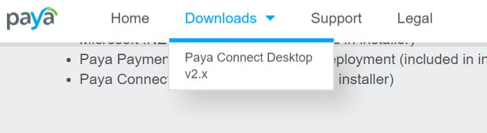
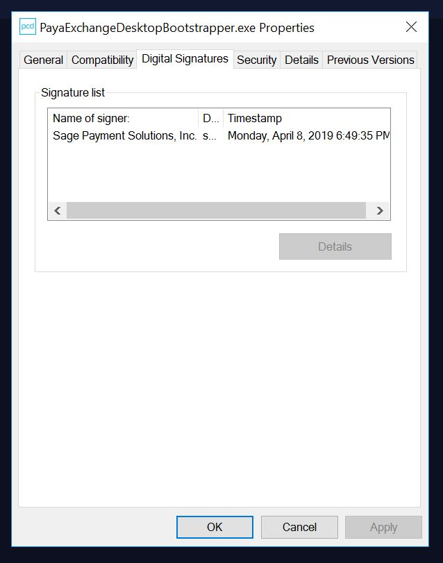
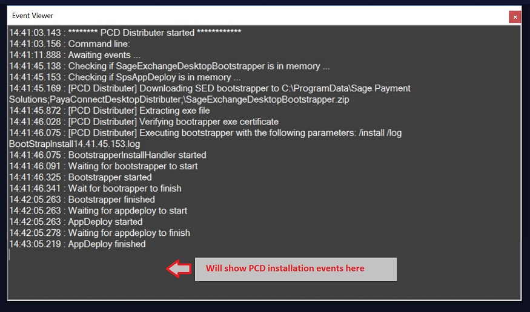
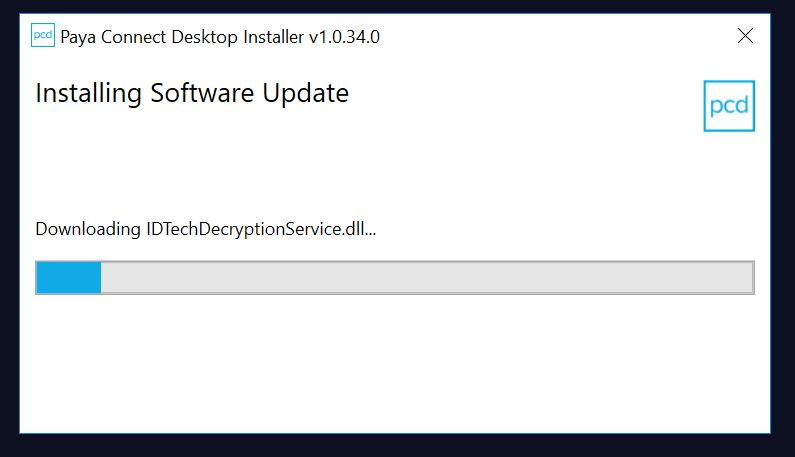
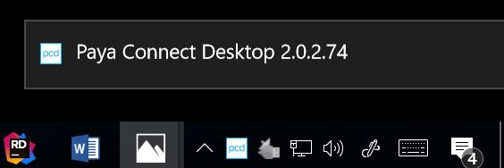
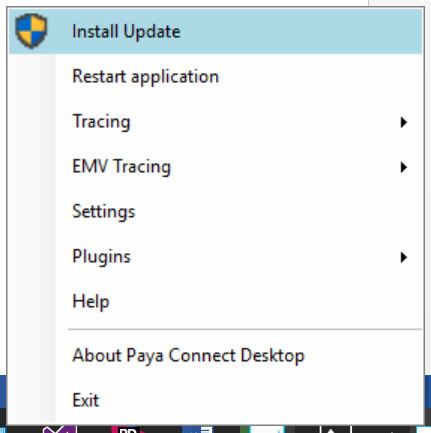
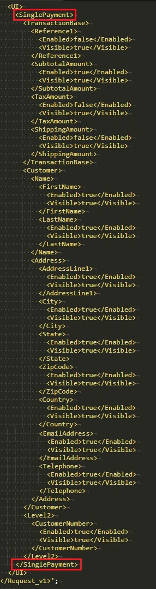
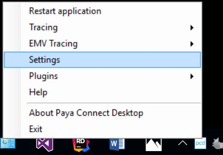
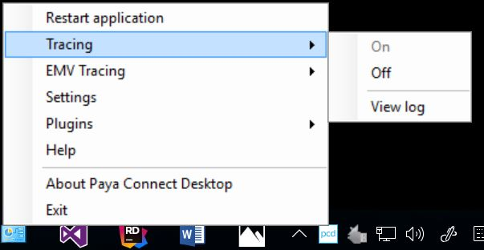

# Introduction
Paya Connect Desktop (PCD 2.0) is an installed .Net application which is fully PCI-DSS compliant. PCD 2.0 allows an ISV to completely remove all sensitive payment data from their application workflow by leveraging the Paya Connect Desktop UI interface. Features like tokenization, Level III processing, and EMV are baked directly into the same API.

This document includes details about installing and setting up PCD 2.0 on your system so that you can quickly get started developing applications:

1. [QuickStart and Installation](#QuickStart)
1. [Installation Details](#Installation)
1. [Customizing PCD 2.0](#Customizing)
1. [Supported Hardware](#Hardware)
1. [EMV Device Setup](#EMVSetup)
1. [Troubleshooting](#Troubleshooting)

##  QuickStart and Installation
The following sections cover installing and using PCD 2.0 on your system:
* [Installation](#QSInstall)
  * [Manual Install (default)](#Manual)
  * [Silent Install (enterprise)](#Silent)
* [Updating PCD 2.0](#Update)
* [Using PCD 2.0](#Using)

###  Installation
The following sections define the installation process for the two versions of PCD 2.0 offered by Sage Payment Systems:
* [Manual Install](#Manual) (default) - The manual installation process installs PCD 2.0 on a single, user controlled machine.
* [Silent Install](#Silent) (enterprise) - The Silent Install version of PCD 2.0 is recommended for larger organizations who have admin restrictions at the user/workstation level. It makes it possible to push installation and updates to multiple workstations across an organization.

####  Manual Install
The steps below refer to the Manual Install version of PCD 2.0. These steps cover most installations of PCD 2.0. The Manual Install version updates automatically when Sage Payments issues a new update to the product.

To manually install PCD 2.0 on your system, first download and verify the installation file; then, run the installer. The following sections provide step-by-step instructions for performing these actions.

_Remove any previously installed versions of SED before installing the most recent version. See the section **[Uninstalling SED](#Uninstalling)** if needed._

##### Verify the installation files

Follow the steps below to download and verify the PCD 2.0 installation tool:
1. Go to https://www.sageexchange.com/install/ and download the PCD 2.0 installer.
    1. Select **Paya Connect Desktop v2.x** from the **Downloads** menu at the top of the page, as shown below:

        

        

        

    1. Scroll down to the **Manual Installation** section and click **Download Installer** in the **Paya Connect Desktop 2.0** row.

1. Extract the zip file anywhere on your local machine.
1. Verify the digital signature of the files you downloaded.
    1. Right click **SageExchangeDesktopBootstrapper.exe** and select **Properties**. The SageExchangeDesktopBootstrapper.exe Properties window opens.

      

      

      

    2. Click the **Digital Signatures** tab and verify that the package is signed by **Sage Payment Solutions, Inc.**
    3. Click the line showing **Sage Payment Solutions, Inc.** in the Signature list area to select it.
    4. Click **Details**. The **Digital Signature Details** window opens.

        

        

        

    5. Under **Digital Signature Information** check that the message displays "This digital signature is OK."
    6. Click **OK** to close the **Digital Signature Details** window.
    7. Click **OK** to close the **SageExchangeDesktopBootstrapper.exe Properties** window.

##### Install PCD 2.0
Follow the steps below to install PCD 2.0 on your local machine:
1. Right click **SageExchangeDesktopBootstrapper.exe** and select **Run as administrator**.
1. Enter your administrator credentials and then click **OK** to continue. The **Paya Connect Desktop Setup** window opens.

    

    

    

1. Review the Paya End User License Agreement (EULA) and then select **I agree to the license terms and conditions**.
1. Click **Install** to start the installation.
1. Click **Yes** on the **User Account Control** window to allow the installer to make changes to the computer. A progress bar displays, indicating the status of the installation.

    

    

    

1. A status message displays when the installation is complete. Click **Close** to close the **Paya Connect Desktop Setup** window.

    

    

    

####  Silent Install
The Silent Install version of PCD 2.0 is recommended for larger organizations who have admin restrictions at the user/workstation level. It is also useful for enterprise organizations who have the ability to push network installation (group policy). The Silent Install version does not update automatically.

PCD 2.0 Silent Installation is a Windows Installer file (a file with MSI extension) that internally uses existing standard PCD 2.0 installation process but does not require any user input.

The following sections describe how to use the PCD 2.0 Silent Installation:
* Requirements
* Installation
* Distribution

##### Requirements
PCD 2.0 Silent Installation requires the following items:
* Internet access to download the latest PCD 2.0 Bootstrapper
* AppDeploy version 1.0.5 or higher (delivered inside the Bootstrapper package)

##### Installation
Follow the steps below to download and install the PCD 2.0 Silent Installation:
1. Download the PCD 2.0 Silent Installation file from https://www.sageexchange.com/install.
    1. Select **Paya Connect Desktop v2.x** from the **Downloads** menu at the top of the page, as shown below:
        

        

        

    1. Scroll down to the **Silent Installation** section and click **Download Installer** in the **Paya Connect Desktop Distributor** row.

        

        

        

1. Run the file when it has finished downloading. The file installs the latest version of PCD 2.0 without displaying any user interface. No additional user actions are required during the installation.

When the installation is completed, a **Paya Connect Desktop** shortcut will be available in the Start Menu under the **Sage Payment Solutions** folder, as shown below:

  

  
  _Note: The image above is from Windows 7.
  The menu may look different on your system._
  

##### Distribution
The PCD 2.0 Silent Install installs the **Paya Connect Desktop Distributer** application.

The PCD Distributer application includes the following features:
* Install PCD 2.0 in attended and unattended/silent modes.
* Check whether a user skipped the last PCD 2.0 update.
* Enable and disable the PCD 2.0 update check that is usually performed when the application launches.

The PCD Distributer application is installed in one of the following locations depending on your system architecture:
* Program Files\Sage Payment Solutions\Application Distributer
* Program Files (x86)\Sage Payment Solutions\Application Distributer

The following user interface displays when you execute the Application Distributer program without any command line arguments:
  

  

  

Select the appropriate options for your system and click **Save & Close**.

The PCD Distributer application supports the following command line arguments:
* /Quiet – Hides the UI and installs the latest available PCD 2.0 without any user interaction.
* /EnableSEDUpdate - Enables PCD 2.0 check for updates every time PCD 2.0 starts.
* /DisableSEDUpdate - Disables PCD 2.0 check for updates every time PCD 2.0 starts.
* /? or /ShowEvents - Shows help information in the event viewer window and waits for PCD installation events as shown in the image below.

  

  

  

###  Update PCD 2.0
Follow the steps below to update PCD 2.0 immediately following installation or any time you launch the program.
1. Whenever updates are available, PCD 2.0 will prompt you to install them.

    

    

    

1. Click **Download and Install** to begin the update. A progress bar displays to show the status of the installation.

    

    

    

###  Using PCD 2.0
After installing PCD 2.0 and every time you start up Windows, the PCD 2.0 application will automatically launch. During startup the animated taskbar icon displays a rotating double-arrow icon as it loads and checks various startup parameters.

Once PCD is successfully running and ready for use, the PCD taskbar icon will change to a green and white SE text box and a Paya Connect dialog bubble will display for a few seconds as shown below:

#### Paya Connect Desktop Menu
Once startup is complete, access the PCD 2.0 menu by right-clicking on the taskbar icon.

##### About Paya Connect Desktop
To verify the version of PCD that is currently installed and running, click **About Paya Connect Desktop** on the menu. The version number displays in the lower portion of the window.  Other information on the screen includes the copyright details and the main Sage Payments support page URL and phone number.

 

 

#### Start Menu
As part of the installation process, the setup program installs a shortcut to launch PCD 2.0 in the Windows start menu.

 

 

 Click the shortcut to launch PCD 2.0.

## Installation Details
The following sections provide information about installing, updating, and uninstalling PCD 2.0, and provide details needed for distributing applications that use the PCD 2.0 API:

1. [Components](#Components)
1. [Dependencies](#Dependencies)
1. [Distribution](#Distribution)
1. [External Device Components](#ExternalDevices)
1. [Uninstalling](#Uninstalling)
1. [Updates](#Updates)
1. [Upgrading](#Upgrading)

###  Components
Paya Connect Desktop requires the installation of three software components. The installation of PCD 2.0 and all dependencies is automated by the **Paya Connect Desktop Bootstrapper**. In addition to the three Sage components, it will detect whether the Microsoft .Net 4.6 Framework is installed and will update the machine if required.

The installation process requires Administrator permissions and will prompt for password and acknowledgement based on the current user’s permission level and User Access Control (UAC) settings.

#### Sage Application Components
The PCD Bootstrapper application installs the following components:

| Component                  | Description |
|---                         |---          |
| SPS Application Deployment | Sage application that manages the installation and updating of the Paya Connect Desktop.                         |
| Sage Exchange Desktop API  | Sage class library that exposes COM interfaces used for integrating payment processing into external applications. |
| Sage Exchange Desktop      | Sage application used for processing payments and Paya Connect messaging.                                     |

##### Sage Payment Solutions (SPS) Application Deployment
The SPS Application Deployment is bundled with the PCD Bootstrapper installer.

###### Installation path
SPS Application Deployment is installed at the following location on your machine:
* [PROGRAM FILES]\Sage Payment Solutions\Application Deployment

###### Registry Entries
The following registry entries are related the SPS Application Deployment application and can be used to detect a valid installation from external software. If these keys are not present in the registry then it is an indication that the installation of this component failed:
* [LOCAL MACHINE]\Software\Sage Payment Solutions\Application Deployment\Path
* [LOCAL MACHINE]\Software\Sage Payment Solutions\Application Deployment\Installation Directory

##### Paya Connect Desktop API
The Paya Connect Desktop API is bundled with the Paya Connect Desktop installer.

###### Installation Path
The Paya Connect Desktop API is installed at the following location on your machine:
* [PROGRAM FILES]\Sage Payment Solutions\Sage Exchange Desktop API

###### Registry Entries
The following registry entries are related to the COM classes/interfaces supported by the API and can be used to detect a valid installation from external software. If these keys are not present in the registry then it is an indication that the installation of this component failed:
* [LOCAL MACHINE]\Software\Classes\CLSID\{CF5D885D-7838-4807-A2BA-BB0D92D9B1EA}
* [LOCAL MACHINE]\Software\Classes\CLSID\{AF364412-E730-4738-91BB-B73124B96633}
* [LOCAL MACHINE]\Software\Classes\clSedApi.ModuleClient
* [LOCAL MACHINE]\Software\Classes\clSedApi.ModuleResponse

##### Paya Connect Desktop Application (PCD 2.0)
If PCD 2.0 is not already installed, the API will prompt the user to install it at runtime.  If the user clicks yes, the Bootstrapper will automatically download and install.
###### Installation Path
PCD 2.0 is installed at the following location on your machine:
* C:\Program Files (x86)\Sage Payment Solutions

The installation folder contains only the deployment reference file. The actual Paya Connect Desktop application files are managed by the SPS Application Deployment and can be found under its installation path.

###### Start Menu Shortcut
The PCD Bootstrapper application adds a shortcut to PCD 2.0 to the Start Menu, which is stored at the following location:
* C:\ProgramData\Microsoft\Windows\Start Menu\Programs\Sage Payment Solutions

###### Registry Entries
The following registry entry is related the Paya Connect Desktop application and can be used to detect a valid installation from external software. If this keys is not present in the registry then it is an indication that the installation of this component failed:
* [LOCAL MACHINE]\Software\Sage Payment Solutions\Sage Exchange Desktop\Path

###  Dependencies
PCD 2.0 has the following dependencies:

| Component             | Description                                                   |
|-----------------------|---------------------------------------------------------------|
| MS .Net 4.6 Framework | Microsoft core .Net common application framework version 4.6. |
| Windows OS            | Microsoft Windows 7 SP1 or higher                             |

If the dependencies are not already installed on your machine, the PCD Bootstrapper application will prompt you to install them.

###  Distribution
The Paya Connect Desktop API (clSedApi.dll) may be bundled stand-alone with third party applications that have integrated with PCD 2.0. The API will detect the need to install PCD 2.0 at runtime and prompt the user for installation. The installation steps outlined above will start automatically.

_**Note:** The installation requires elevation to local machine Administrator level._

###  External Device Components
PCD 2.0 supports additional peripheral hardware devices. Some of these devices require that additional components be installed in order to function properly. Since the hardware devices are optional these components are separate from the Paya Connect Desktop installation. It is recommended you review your application requirements to determine which, if any, hardware devices you will be supporting in order to properly deploy the PCD 2.0 to your end users.   

### Uninstalling
The programs installed as part of the PCD installation will be displayed in the Windows **Programs and features** list. To uninstall PCD, remove the following programs:
* SPS Application Deployment
* Paya Connect Desktop

Select each program from the list and click **Uninstall** on the following window.

 

 

###  Updates
The PCD 2.0 application automatically checks for application updates at launch and periodically while running. It is possible that upon first launch after initial install a new update will be available.

When an update is available, the update process will launch automatically. The update check can also be initiated manually from the PCD menu.

If a new release of PCD is available, the update process will launch. The following window displays the new version and release notes:

 

 

The release notes are cumulative and can be reviewed by scrolling the window.

Click the **Download and Install** button to continue.

Administrator permissions are required to perform the update.

If the update is mandatory, it must be applied before PCD can be started, and the Skip button in the update window will be disabled. If the update is optional, you can click Skip to update at a later time. Optional updates are recommended to be applied as soon as possible, and the update check will continue to display the available update until it is installed.

###  Upgrading from SED 1.0 to PCD 2.0
The main Sage Exchange Desktop 1.0 components should be removed prior to installing PCD 2.0. This includes Sage Exchange and the Module SDK.  Sage Exchange device drivers for credit card terminals do not have to be uninstalled or reinstalled. Current SED 1.0 devices are also supported on PCD 2.0.  Within the Windows Control Panel, the Programs and Features utility can be used to uninstall the following two programs.

*	Sage Exchange version 1.0.6.x (or earlier)
*	Module SDK version 1.0.x  

These programs will be listed with Publisher Sage Payment Solutions. Sorting by publisher will help locate the currently installed Sage applications.  Click the program in the list to select it and click Uninstall in the title banner of the list. Follow the prompts to uninstall and remove the existing 1.0 components.

#### Key Differences from SED 1.0
The Paya Connect Desktop 2.0 application looks and functions much the same way as the 1.0 version with some key differences worth noting for those familiar with the previous version. The Sage Exchange SDK has been superseded by the Paya Connect Desktop API. The new API interface is essentially the same but does require a recompile and minor changes for existing third-party integrations. The SED 1.0 underlying Sage Exchange XML messaging formats and structures are forwards compatible.

The following table lists the differences between the components and features of PCD 2.0 and SED 1.0:

| Component               | PCD 2.0.n.x                 | SED 1.0.6.x               |
|-------------------------|-----------------------------|---------------------------|
| .Net Framework          | .Net 4.6                    | .Net 3.5                  |
| PA-DSS Compliance       | PA-DSS 3.1                  | PA-DSS 2.0                |
| Encryption Level        | TLS 1.2                     | TLS 1.0                   |
| Installation Framework  | Microsoft Installer (WiX)   | Microsoft ClickOnce       |
| Deployment Framework    | SPS App Deploy              | Microsoft ClickOnce       |
| Installation            | All Users (per machine)     | Current User              |
| Install Location        | Program Files               | User AppData Directory    |
| Installation Permission | Administrator               | Local User                |
| Auto Updates Permission | Administrator               | Local User                |
| Publisher Certificate   | CA Issued Code Signing Cert | Sage SPS Self-signed Cert |
| Integration Component   | Sage Exchange Desktop API   | SPS Module SDK            |

#### References
The PCD 2.0 API implements the same methods and includes the same interface as the SED 1.0 Module SDK. To upgrade your solution from SED 1.0 to PCD 2.0, you will need to change the references to use the new PCD 2.0 API.

The table below defines the new identifiers and key values that you will need to update in your code:

| Component           | PCD API v2.0                          | SED API v1.0                          |
|---------------------|---------------------------------------|---------------------------------------|
| .Net Framework      | .Net 4.6                              | .Net 3.5                              |
| Install Location    | Program Files\\Sage Payment Solutions | Program Files\\Sage Payment Solutions |
| Installation Folder | \\Sage Exchange Desktop API           | \\Sage Payment Module SDK             |
| Loadable DLL        | clSedApi.dll                          | SpsModuleSdkCL.dll                    |
| Client PROGID       | clSedApi.ModuleClient                 | SpsModuleSdkCL.ModuleClient           |
| Response PROGID     | clSedApi.ModuleResponse               | SpsModuleSdkCL.ModuleResponse         |
| Client CLSID        | CF5D885D-7838-4807-A2BA-BB0D92D9B1EA  | 89BB4535-5A89-43a0-89C5-19A4697E5C5C  |
| Response CLSID      | AF364412-E730-4738-91BB-B73124B96633  | 41A449A9-EFA9-45e5-A6BD-9896A8194CD0  |
| COM Objects         | IModuleClient/IModuleResponse         | IModuleClient/IModuleResponse         |
| SED Not Detected    | API Initiates SED 2.0 Install         | SDK Initiates SED 1.0 Install         |

##  Customizing PCD 2.0
You can customize Paya Connect Desktop v2.x for your application by modifying the default colors of the user interface and choosing to hide or show fields.

### Modifying the User Interface
You can modify elements such as text color, background color, and group box color, and hide or show elements and fields on the Paya Connect Desktop user interface by changing default values of tags in the &lt;UI\> (user interface) section of XML code for each user interface XML transaction.

 

 

#### Hiding or Showing fields
The tags in the &lt;SinglePayment>&lt;/SinglePayment> section within the UI code allow you to show or hide fields on the Payment Information page of the PCD user interface. For example, you can choose to hide fields such as Reference Number or Shipping in the Totals group box or extra address lines on the Billing Information page by setting the tag values to false.

The image below shows the SinglePayment section of the PCD 2.0 XML messaging specification. Change the value of the &lt;Visible> element from 'true' to 'false' to hide that field on the user interface:

 

 

#### Disabling Manual Card Number Entry
You can also use the UI section of the XML message to prevent credit card numbers from being manually entered. Add the &lt;CanEnterAccount> tag (and value) to your code to disable manual entry in the Card Number field on the Sale window. This will require the user to swipe or dip the card, or to key the credit card number on the hardware terminal connected to Paya Connect Desktop.

The following image shows the &lt;CanEnterAccount> element:

 

 

The image below shows how the Card Number field is disabled for entry on the Sale window if you add the tag above to your code:

 

 

##  Supported Hardware
The Paya Connect Desktop is compatible with a wide variety of EMV and non-EMV compatible card readers.

Different fees may apply, depending on the device your organization uses.

### EMV Devices
PCD 2.0 supports the following EMV enabled devices:
* [PAX S300](http://www.pax.us/portfolio_page/s300-integrated-retail-pinpad/)
* [Equinox L5300](https://www.equinoxpayments.com/products/l5000/)
* [IDTech Augusta](https://www.idtechproducts.com/products/swipe-reader-writers/the-augusta-an-emv-l1-l2-chip-and-magstripe-reader)
* Ingenico IPP320 - PCD supports four versions of the IPP320 for different security needs and service providers:
  * [IPP320 Standard](https://ingenico.us/smart-terminals/telium2/payment-terminals/ipp-series/ipp-320.html) - The _Standard_ version of the IPP320 leverages the Paya Connect Desktop software-based encryption.
  * [IPP320 Advanced Security](https://ingenico.us/smart-terminals/telium2/payment-terminals/ipp-series/ipp-320.html) - The _Advanced Security_ version of the IPP320 leverages terminal-based encryption (P2PE) provided by Sage Payment Solutions.
  * [IPP320 PCI Listed P2PE](https://ingenico.us/smart-terminals/telium2/payment-terminals/ipp-series/ipp-320.html) - The _PCI Listed P2PE_ version of the IPP320 leverages terminal-based encryption provided by [BlueFin](https://www.bluefin.com/products/p2pe-point-to-point-encryption/decryptx/) which is fully PCI/P2PC validated.
  * [IPP320 Moneris](https://ingenico.us/smart-terminals/telium2/payment-terminals/ipp-series/ipp-320.html) - PCD 2.0 supports the IPP320 provided by Moneris. This version uses Moneris security and processes payments on Moneris systems.

### Non-EMV Devices
PCD 2.0 supports the following Non-EMV devices:
* [ID Tech SecureMag](https://www.idtechproducts.com/products/swipe-reader-writers/securemag-encrypted-intelligent-magstripe-reader)
* [Ingenico IPP320 provided by Chase Paymentech](https://en.chasepaymentech.ca/pin_pads.html)
* Magtek [DynaMag](https://www.magtek.com/product/dynamag) and [DynaPad](https://www.magtek.com/product/dynapad)

##  EuroPay, Master Card, and Visa (EMV) Device Setup
The following sections describe how to set up a chip enabled terminal to process EMV transactions using PCD 2.0.

Paya Connect Desktop v2.x is certified on the following devices:
* Ingenico IPP320
* Equinox L5300
* PAX S300

### Downloading Device Drivers
You can download the recommended drivers for each device from the Paya Connect Desktop Installation web site. Be sure to download the correct **EMV-Compatible** driver.

### Enabling the Device
After you install the device drivers, follow the steps below to enable your device in Paya Connect Desktop.

1. Right-click the green **SE 2.0** icon in the Microsoft Window system tray and then click **Settings** from the submenu to open the Paya Connect Desktop – Settings window.

 

 

1. Expand the **Hardware** node on the left-hand side and then click **EMV Devices**.

1. On the right-hand side, click your installed device (or devices) from the list of **Available Devices**. Paya Connect Desktop will restart, and you will be ready to accept payments.

 

 

## Troubleshooting
The following sections describe where to locate log files and how to configure a Moneris QA server, if your PCD 2.0 implementation is not functioning as expected.

### Log Files
In the event a Paya Connect Desktop installation fails, please check that the user installing the application has the proper permissions.

Log file paths may vary slightly between different computers. Some folders (e.g., AppData) may be hidden by default.

To view the log files, right-click the green **SE 2.0** icon in the Microsoft Window system tray.

Click **Tracing**, and select **View Log** from the menu.

  

 

 

#### Installation Logs
Installation logging is automatically enabled. The logs can be found in in the following directory:
* C:\Users\[USER]\AppData\Local\Sage Payment Solutions\Application Deployment

#### Application Logs
Application logging must be enabled by turning on “Tracing” in the PCD 2.0 menu. The logs can be found in the following location or by selecting the View Log option in the PCD 2.0 menu:
* C:\Users\[USER]\AppData\Local\Sage Payment Solutions\Sage Exchange Desktop

### Moneris QA Server
There is a configuration variable that will allow you to point PCD towards the Moneris QA server. This only applies when using the Moneris iPP320.

Follow the steps below to point your PCD 2.0 installation to the Moneris QA server:
1.	Close PCD.
2.	Run Notepad (or your preferred text editor) as an administrator.
3.	Open [PROGRAM FILES]\Sage Payment Solutions\Application Deployment\Applications\[GUID]\[VERSION]\SageExchange.exe.config.
4.	Look for UseMonerisQAHost and set it to either True or False as desired.
5.	Save the file.
6.	Close Notepad.
7.	Open PCD.

The application log will indicate whether or not it is attempting to use the QA server.
